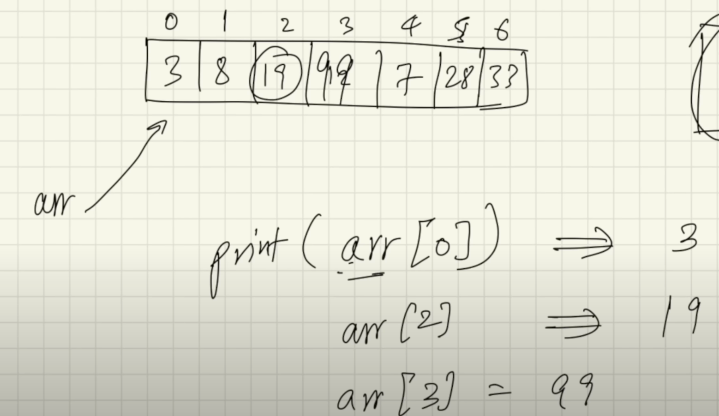
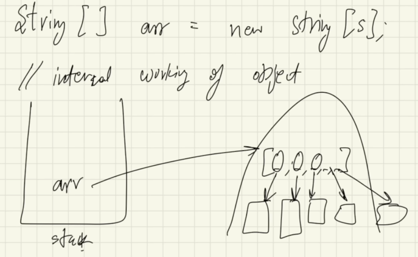

### Array :-

Why we need array ???

Suppose you have to store 1000 numbers, so you can store it in 1000 variables but it is not a good practice. So, we use array to store multiple values in a single variable.
Suppose We want to store the marks of 100 students, so we can store it in 100 variables but it is not a good practice. So, we use array to store multiple values in a single variable.
Also we want to store the names of 100 students, so we can store it in 100 variables but it is not a good practice. So, we use array to store multiple values in a single variable.

// Like this 

int a = 10;
String name = "Ankit Maurya";

int b = 20;
String name1 = "Lucky Mishra";

....

It not possible to store 1000 values in 1000 variables. So, we use array to store multiple values in a single variable.

## Syntax of Array :-

```java

dataType[] arrayName = new dataType[size];

```

Q. Store 5 roll numbers in an array.

```java

int[] rollNumbers = new int[5];
//OR
int[] rollNums = {1, 2, 3, 4, 5};

```

Note:

1. Array index starts from 0.
2. Array index ends at n-1, where n is the size of the array.
3. Array size is fixed, once we define the size of the array, we can't change it.
4. We can't store different data types in an array.
5. We can store only similar data types in an array.
6. We can store primitive data types as well as non-primitive data types in an array.
7. We can store user-defined data types in an array.
8. We can store null values in an array.
9. Datatype should be what we are going to store in array.


## How Array Works Internally :-

```java

int[] arr;  // Declaration       --> arr is getting created in stack memory.
arr = new int[5];  // (Initialaization) Memory Allocation --> Actually here object is getting created in heap memory.

```


// arr is a reference variable which is pointing to the object in heap memory.

int[]  arr = new int[5];    
dataType[] arrayName = new dataType[size];
Compile Time = Run Time

// Here at the runtime the memory allocated. Its called **dynamic memory allocation**.


How it works in Stack Memory and Heap Memory :-

1. Array object is created in heap memory.
2. Reference variable is created in stack memory.
3. Reference variable is pointing to the object in heap memory.
4. We can access the array object using the reference variable.


**Arrays Objects are not continous in JAVA ?? Reason .**
Ans:
1. In Java, Array objects are stored in heap memory.
2. In Java, heap memory is divided into small parts called **Heap Segments**.
3. Array objects are stored in different heap segments.
4. And memory allocation is done in heap memory using **Dynamic Memory Allocation**.
4. That's why Array objects are not stored in contiguous memory locations in Java.
5. Hence it may not be contiguous. Totally depends on the JVM.

## Array in Java Vs Array in C++ :-
1. Array object is created in stack memory.
2. We can't store large amount of data in array in C++. Because the stack memory is limited.
3. In C++ we can store large amount of data in array using dynamic memory allocation.
4. In C++ user has to manage the memory allocation and deallocation using Pointers. But in Java, JVM manages the memory allocation and deallocation.


**What is Index of Array ?**



```java
int arr[] = [3,5,8,90,674,35,67,23,835,75];
sout(arr[0])  => 3
sout(arr[1])  => 5
sout(arr[2])  => 8
sout(arr[3])  => 90
```

**What is new Keyword ?**

int[] arr = new int[5];

- Here **new** is used to create the object in the heap memory
- new is used to allocate the memory in heap memory.
- new is used to create the object of the class.
- new is used to create the array object.
- new is used to create the instance of the class, array, interface, etc.


Q. what if we declare the array but not initialize it ?

```java
int[] arr;  
System.out.println(arr);  // error not initialized

```

Q. what if we declare the array and initialize it but not assigned values ?

```java
int[] arr;
arr = new int[5];
System.out.println(arr[0]); // 0

// but in case of String
String[] arr = new String[5];
System.out.println(arr[0]); // null
// because in case of String, default value is null.
// Null is a special value which is used to represent the absence of a value. its called literal value.
```

## What is premetive data types and non-premetive data types ?

In Java, data types are categorized as either primitive or non-primitive.

**Primitive Data Types:**

These are the most basic data types in Java and represent single values.
They are predefined by the language and are stored directly in memory.

There are 8 primitive data types in Java:

- byte: Stores whole numbers from -128 to 127. Takes up 1 byte of memory. 
- short: Stores whole numbers from -32,768 to 32,767. Takes up 2 bytes of memory. 
- int: Stores whole numbers from -2,147,483,648 to 2,147,483,647. Takes up 4 bytes of memory. 
- long: Stores whole numbers from -9,223,372,036,854,775,808 to 9,223,372,036,854,775,807. Takes up 8 bytes of memory. 
- float: Stores single-precision floating-point numbers. Takes up 4 bytes of memory. 
- double: Stores double-precision floating-point numbers. Takes up 8 bytes of memory. 
- char: Stores a single character. Takes up 2 bytes of memory. 
- boolean: Stores true or false values. Takes up 1 bit of memory.

**Non-Primitive Data Types:**

Also known as reference types, these data types are not predefined by the language.
They are created by the programmer and store references to objects in memory.

Some common examples of non-primitive data types are:

- String: Represents a sequence of characters. 
- Arrays: Used to store a collection of elements of the same type. 
- Classes: User-defined blueprints for creating objects. 
- Interfaces: Contracts that define a set of methods that a class must implement.

**Key Differences:**

1. Memory Allocation: Primitive types store values directly in memory, while non-primitive types store references to memory locations where the object is stored. 
2. Null Values: Primitive types cannot be null, while non-primitive types can be null. 
3. Mutability: Primitive types are immutable, meaning their values cannot be changed once assigned. Non-primitive types are mutable, meaning their values can be modified.

Example:

```java
int age = 30; // Primitive data type
String name = "John"; // Non-primitive data type
```

## String Array :-

```java
String[] names = new String[5];
names[0] = "Ankit";
names[1] = "Lucky";
```

## Internal working of String Array :-



```java
String[] names = new String[5];
names = "Ankit";
// Here names is a reference variable which is pointing to the object in heap memory.
// Here 5 memory locations are created in heap memory.
// names[0] is pointing to the first memory location (Ankit).

// And that location is storing the value "Ankit". Itself a collection of characters objects.
```


--------------------------------------------------------------------------------------------------------------------------------------------

## **How to take inputs in Java ?**

```java
import java.util.Scanner;

public class Input {
    public static void main(String[] args) {
        Scanner sc = new Scanner(System.in);
        
        //**Array of Primitive Data Types**
        int[] arr = new int[5];
        arr[0] = 23;
        arr[1] = 45;
        arr[2] = 233;
        arr[3] = 543;
        arr[4] = 3;
        // [23, 45, 233, 543, 3]
        System.out.println(arr[3]);    //543


        //Input using for loops
        for (int i = 0; i < arr.length; i++) {
            arr[i] = sc.nextInt();
        }

        //Output using for loops
        for (int i = 0; i < arr.length; i++) {
            System.out.print(arr[i] + " ");
        }
        
        //Output using for each loop
        for (int element : arr) {              //for every element of the array arr, print the element
            System.out.print(element + " ");    //here element is a variable which is storing the value of the array element. it can be anything.
        }
        
        
        //what is the difference between for loop and for each loop ?
        //for loop is used when we know the index of the array.
        //for each loop is used when we don't know the index of the array.
        
        //What if we try to acces the element of the array which is not present ?
        System.out.println(arr[5]);    //ArrayIndexOutOfBoundsException
        
        // Another way to print the array is using Arrays class (.toString() method) :
        System.out.println(Arrays.toString(arr));            // [23, 45, 233, 543, 3]
        
        
        
        //**Array of Non-Primitive Data Types || Array of Objects :**
        String[] names = new String[5];
        for (int i = 0; i < names.length; i++) {
            names[i] = sc.next();
        }

        System.out.println(Arrays.toString(names));    // [Ankit, Lucky, Maurya, Mishra, Ankit]
        
        //changing the value of the array element
        names[0] = "Shubham";
        System.out.println(Arrays.toString(names));    // [Shubham, Lucky, Maurya, Mishra, Ankit]
        //it will change the value of the first element of the array to "Shubham"
        
        
        //taking input of the array of objects using for each loop
        for (String name : names) {
            System.out.print(name + " ");   //Shubham Lucky Maurya Mishra Ankit
        }
        
    }
}
```

**Array passing in Function :-**

```java
import java.util.Scanner;

publoc class passingFunctions {
    public static void main(String[] args) {
        int nums[] = {1, 2, 3, 4, 5};
        System.out.println(Arrays.toString(nums));    // [1, 2, 3, 4, 5]
        change(nums);
        System.out.println(Arrays.toString(nums));    // [10, 20, 30, 40, 50]
    }

    static void change(int[] arr) {
        for (int i = 0; i < arr.length; i++) {
            arr[i] = arr[i] * 10;
        }
    }
}
```

why the value of the array is changing in the main function ?

- In Java, when we pass an array to a function, we are actually passing the reference of the array.
- So, when we change the value of the array in the function, it will also change the value of the array in the main function.
- Because both the arrays are pointing to the same memory location.
- So, the value of the array will change in both the functions.
- This is called **Call by Reference**.
- In Java, arrays are always passed by reference.
- In Java, objects are always passed by reference.
- In Java, arrays, strings, wrapper classes, user-defined classes, interfaces everything are objects.
- In Java, everything is passed by reference.
- In Java, everything is passed by value.

Difference between Call by Value and Call by Reference :

- In Call by Value, the value of the variable is passed to the function.
- In Call by Reference, the reference of the variable is passed to the function.
- In Call by Value, the value of the variable is copied to the function.
- In Call by Reference, the reference of the variable is copied to the function.
- In Call by Value, the value of the variable is not changed in the main function.
- In Call by Reference, the value of the variable is changed in the main function.
- In Java, everything is passed by value.
- In Java, everything is passed by reference.

**Java is strictly pass-by-value. However, this can be confusing because when you pass an object to a method, you are passing the reference to that object by value. This means that while the reference itself is passed by value, the method can still modify the object that the reference points to.**


## Multi-Dimensional Array :-

```java
public class MultiDimensional{
    public static void main(String[] args) {
        /*
        1 2 3
        4 5 6
        7 8 9
         */
        
        //2D Array
        int[][] arr = new int[3][3];
        
        //Or we can also write it as :
        int[][] arr2 = {
            {1, 2, 3},
            {4, 5, 6},
            {7, 8, 9}
        };
        
        //Accessing the elements of the 2D array
        System.out.println(arr2[0][0]);    //1
        System.out.println(arr2[1][1]);    //5
        System.out.println(arr2[2][2]);    //9
        
        //2d array can also be like this :
        int[][] arr2d = {
            {1, 2, 3},           //0th index 
            {4, 5},              //1st index
            {6, 7, 8, 9}         //2nd index   -> arr2d[2] = {6, 7, 8, 9}
        };
        
        //Input in 2D array
        
        //for each rows
        for (int i = 0; i < arr2d.length; i++) {         //arr2d.length = 3
            //for each columns
            for (int j = 0; j < arr2d[i].length; j++) {   //arr2d[i].length = 3, 2, 4
                arr2d[i][j] = sc.nextInt();
            }
        }
        
        
        //Output in 2D array
        for (int i = 0; i<arr2d.length; i++){
            for (int j =0; j<arr2d[i].length; j++){
                System.out.println(arr2d[i][j] + " ");
            }
        }
        
        //Output in 2D array using for each loop
        for (int[] row : arr2d) {
            for (int element : row) {
                System.out.print(element + " ");
            }
            System.out.println();
        }
        
        //Output in 2D array using Arrays class (for each loop)
        for (int[] row : arr2d) {
            System.out.println(Arrays.toString(row));      //[1, 2, 3] [4, 5] [6, 7, 8, 9]
        }
        
        //Output in 2D array using Arrays class (loop method)
        for (int i = 0; i < arr2d.length; i++) {
            System.out.println(Arrays.toString(arr2d[i]));   //[1, 2, 3] [4, 5] [6, 7, 8, 9]
        }
        
        //Output in 2D array using Arrays class (deepToString() method)
        System.out.println(Arrays.deepToString(arr2d));     //[[1, 2, 3], [4, 5], [6, 7, 8, 9]]
        
    }
}
```


**Jagged Array :-**
A jagged array in Java is an array of arrays where the inner arrays can have different lengths. This means that each row in a two-dimensional array can have a different number of columns. Jagged arrays are useful when you need a multi-dimensional array with varying lengths for each dimension.


### Array Methods :-

1. **Arrays.toString()** : This method is used to return a string representation of the contents of the specified array. The string representation consists of a list of the array's elements, enclosed in square brackets ("[]"). Adjacent elements are separated by the characters ", " (a comma followed by a space).

```java
int[] arr = {1, 2, 3, 4, 5};
System.out.println(Arrays.toString(arr));    // [1, 2, 3, 4, 5]
```

2. **Arrays.sort()** : This method is used to sort the specified array of objects into ascending order. The sorting is done using the natural ordering of the elements.

```java
int[] arr = {5, 2, 8, 1, 3};
Arrays.sort(arr);
System.out.println(Arrays.toString(arr));    // [1, 2, 3, 5, 8]
```

3. **Arrays.binarySearch()** : This method is used to search the specified array for the specified element using the binary search algorithm. The array must be sorted before performing the binary search.

```java
int[] arr = {1, 2, 3, 4, 5};
int index = Arrays.binarySearch(arr, 3);
System.out.println(index);    // 2
```

4. **Arrays.copyOf()** : This method is used to copy the specified array, truncating or padding with zeros (if necessary) so the copy has the specified length.

```java
import org.w3c.dom.ls.LSOutput;

int[] arr = {1, 2, 3, 4, 5};
int[] copy = Arrays.copyOf(arr, 3);
System.out.println(Arrays.toString(copy));    // [1, 2, 3]


int[] arr = {1, 2, 3, 4, 5};
int[] copy = Arrays.copyOf(arr, 7);
System.out.println(Arrays.toString(copy));    // [1, 2, 3, 4, 5, 0, 0]
```

5. **Arrays.equals()** : This method is used to compare the specified arrays for equality. Two arrays are considered equal if they have the same length and all corresponding pairs of elements in the two arrays are equal.

```java
int[] arr1 = {1, 2, 3};
int[] arr2 = {1, 2, 3};
System.out.println(Arrays.equals(arr1, arr2));    // true
```

6. **Arrays.fill()** : This method is used to fill the specified array with the specified value.

```java
int[] arr = new int[5];
Arrays.fill(arr, 10);
System.out.println(Arrays.toString(arr));    // [10, 10, 10, 10, 10]
```

7. **Arrays.deepToString()** : This method is used to return a string representation of the "deep contents" of the specified array. The string representation consists of a list of the array's elements, enclosed in square brackets ("[]"). Adjacent elements are separated by the characters ", " (a comma followed by a space).

```java
int[][] arr = {{1, 2, 3}, {4, 5}, {6, 7, 8, 9}};
System.out.println(Arrays.deepToString(arr));    // [[1, 2, 3], [4, 5], [6, 7, 8, 9]]
```

8. **Arrays.deepEquals()** : This method is used to compare the specified arrays for "deep equality". Two arrays are considered "deeply equal" if they are of the same type and all corresponding pairs of elements in the two arrays are deeply equal.

```java
int[][] arr1 = {{1, 2, 3}, {4, 5}, {6, 7, 8, 9}};
int[][] arr2 = {{1, 2, 3}, {4, 5}, {6, 7, 8, 9}};
System.out.println(Arrays.deepEquals(arr1, arr2));    // true
```

9. **Arrays.copyOfRange()** : This method is used to copy a specified range of the specified array into a new array. The range to be copied extends from the index "from" to the index "to" of the original array.

```java
int[] arr = {1, 2, 3, 4, 5};
int[] copy = Arrays.copyOfRange(arr, 1, 4);
System.out.println(Arrays.toString(copy));    // [2, 3, 4]
```

10. **Arrays.asList()** : This method is used to return a fixed-size list backed by the specified array. The list is serializable and implements RandomAccess.

```java
int[] arr = {1, 2, 3, 4, 5};
List<Integer> list = Arrays.asList(1, 2, 3, 4, 5);
System.out.println(list);    // [1, 2, 3, 4, 5]
```

11. **Arrays.stream()** : This method is used to return a sequential Stream with the specified array as its source.

```java
int[] arr = {1, 2, 3, 4, 5};
IntStream stream = Arrays.stream(arr);
stream.forEach(System.out::println);
```

12. **Arrays.parallelSort()** : This method is used to sort the specified array of objects into ascending order. The sorting is done using the natural ordering of the elements. This method is designed to be used with large arrays and can take advantage of multiple processors.

```java
int[] arr = {5, 2, 8, 1, 3};
Arrays.parallelSort(arr);
System.out.println(Arrays.toString(arr));    // [1, 2, 3, 5, 8]
```

13. **Arrays.parallelPrefix()** : This method is used to perform a parallel prefix operation on the specified array. The operation is performed in parallel and modifies the array in place.

```java
int[] arr = {1, 2, 3, 4, 5};
Arrays.parallelPrefix(arr, (x, y) -> x * y);
System.out.println(Arrays.toString(arr));    // [1, 2, 6, 24, 120]
```

14. **Arrays.parallelSetAll()** : This method is used to set all elements of the specified array using a generator function. The generator function is applied to each index in parallel.

```java
int[] arr = new int[5];
Arrays.parallelSetAll(arr, i -> i * 2);
System.out.println(Arrays.toString(arr));    // [0, 2, 4, 6, 8]
```

15. **Arrays.parallelPrefix()** : This method is used to perform a parallel prefix operation on the specified array. The operation is performed in parallel and modifies the array in place.

```java
int[] arr = {1, 2, 3, 4, 5};
Arrays.parallelPrefix(arr, (x, y) -> x * y);
System.out.println(Arrays.toString(arr));    // [1, 2, 6, 24, 120]
```

like many more methods are there in Arrays class.

--------------------------------------------------------------------------------------------------------------------------------------------

## **Array of Objects :**

```java
import java.util.Scanner;

public class ArrayOfObjects {
    public static void main(String[] args) {
        Scanner sc = new Scanner(System.in);
        
        //Array of Objects
        Student[] students = new Student[5];
        
        for (int i = 0; i < students.length; i++) {
            students[i] = new Student();
            students[i].name = sc.next();
            students[i].rollNo = sc.nextInt();
        }
        
        for (Student student : students) {
            System.out.println(student.name + " " + student.rollNo);
        }
    }
}

class Student {
    String name;
    int rollNo;
}
```

--------------------------------------------------------------------------------------------------------------------------------------------

## ArrayList :-


An ArrayList in Java is a resizable array that is part of the Java Collections Framework. It provides more flexibility than a standard array, as it can grow and shrink dynamically as elements are added or removed. ArrayList is a class that extends AbstractList and implements the List interface.

**Key Features of ArrayList:**

1. Resizable: Automatically resizes itself when elements are added or removed. 
2. Indexed Access: Allows fast random access to elements using an index. 
3. Generic: Can store objects of any type. 
4. Part of Java Collections Framework: Provides various methods for manipulating the size and contents of the list.

- ArrayList is a class cause it Start from Capital Letter.
- ArrayList is a part of the Collection Framework in Java.
- ArrayList is a resizable array that grows dynamically.
- ArrayList is a class that extends AbstractList and implements the List interface.
- ArrayList is a generic class that can store objects of any type.
- ArrayList is similar to an array, but it provides more functionality and flexibility.
- ArrayList is a part of the java.util package.
- ArrayList is a part of the Java Collections Framework.
- ArrayList is a part of the Java Collection API.
- ArrayList is a part of the Java API.
- ArrayList is a part of the Java Standard Library.


```java

public class ArrayList(){
    public static void main(String[] args) {
        
        // Create an ArrayList to store integers
        ArrayList<Integer> numbers= new ArrayList<Integer>();
        //Or can also write like this 
        ArrayList<Integer> nums= new ArrayList<>();


        // Add elements to the ArrayList
        numbers.add(10);
        numbers.add(20);
        numbers.add(30);
        
        // Access elements of the ArrayList
        System.out.println(numbers.get(0));    // 10
        System.out.println(numbers.get(1));    // 20
        System.out.println(numbers.get(2));    // 30
        
        //Take input from the user
        Scanner sc = new Scanner(System.in);
        for (int i = 0; i < 5; i++) {
            numbers.add(sc.nextInt());
        }
        
        // Print the ArrayList
        System.out.println(numbers);    // [10, 20, 30]
        
        // Update elements of the ArrayList
        numbers.set(1, 25);
        System.out.println(numbers.get(1));    // 25
        
        // Check if the ArrayList contains an element
        System.out.println(numbers.contains(20));    // false
        
        // Remove elements from the ArrayList
        numbers.remove(0);
        System.out.println(numbers.get(0));    // 25
        
        // Get the size of the ArrayList
        System.out.println(numbers.size());    // 2
        
        // Check if the ArrayList is empty
        System.out.println(numbers.isEmpty());    // false
        
        // Iterate over the elements of the ArrayList
        for (int i = 0; i < numbers.size(); i++) {
            System.out.println(numbers.get(i));
        }
        
        // Iterate over the elements of the ArrayList using for-each loop
        for (int number : numbers) {
            System.out.println(number);
        }
        
        // Iterate over the elements of the ArrayList using Iterator
        Iterator<Integer> iterator = numbers.iterator();
        while (iterator.hasNext()) {
            System.out.println(iterator.next());
        }
        
        // Clear the ArrayList
        numbers.clear();
        System.out.println(numbers.size());    // 0
        
        
        // Create an ArrayList to store strings
        ArrayList<String> names = new ArrayList<String>();
        names.add("Alice");
        names.add("Bob");
        names.add("Charlie");
        
        // Access elements of the ArrayList
        System.out.println(names.get(0));    // Alice
        System.out.println(names.get(1));    // Bob
        System.out.println(names.get(2));    // Charlie
        
        
        // Create an ArrayList to store objects of a custom class
        ArrayList<Student> students = new ArrayList<Student>();
        students.add(new Student("Alice", 101));
        students.add(new Student("Bob", 102));
        students.add(new Student("Charlie", 103));
        
        // Access elements of the ArrayList
        System.out.println(students.get(0).getName());    // Alice
        System.out.println(students.get(1).getName());    // Bob
        System.out.println(students.get(2).getName());    // Charlie
        
        
    }
}
```

**ArrayList Methods :**

1. add(E e): Appends the specified element to the end of the list. 
2. get(int index): Returns the element at the specified position in the list. 
3. remove(int index): Removes the element at the specified position in the list. 
4. size(): Returns the number of elements in the list. 
5. clear(): Removes all elements from the list.


**Internal working of the ArrayList :**

1. ArrayList is a resizable array that grows dynamically.
2. ArrayList is implemented using an array.
3. When the ArrayList is created, an array of a certain size is allocated in memory.
4. When elements are added to the ArrayList, they are stored in the array.
5. Time complexity of ArrayList is O(1), its anotised complexity. 

**Multi ArrayList :**

- It is similar like 2D array.

```java
import java.util.Scanner;

public class MultiList {
    public static void main(String[] args) {
        Scanner in = new Scanner(System.in);
        
        //Multi ArrayList
        ArrayList<ArrayList<Integer>> list = new ArrayList<>();

        //Initialization 
        for (int i = 0; i < 3; i++) {
            list.add(new ArrayList<>());
        }

        //Add elements
        for (int i = 0; i < 3; i++) {
            for (int j = 0; j < 3; j++) {
                list.get(i).add(in.nextInt());
            }
        }

        System.out.println(list);    //if we inputed 1 2 3 4 5 6 7 8 9
        //output [[1,2,3],[4,5,6],[7,8,9]]
        
    }
}
```


--------------------------------------------------------------------------------------------------------------------------------------------

#Problems :

**Q1. Swapping Vlaues in a Array :**

```java
public class swap{
    public static void main(String[] args) {
        int[] arr = {1, 2, 3, 4, 5};
        System.out.println(Arrays.toString(arr));    // [1, 2, 3, 4, 5]
        swap(arr, 1, 3);
        System.out.println(Arrays.toString(arr));    // [1, 9, 23,3, 18]
    }
    
    static void swap(int[] arr, int index1, int index2){
        int temp = arr[index1];
        arr[index1] = arr[index2];
        arr[index2] = temp;
    }
}

```

**Q2. Maximum Value in Array : **

```java
public class maximum{
    public static void main(String[] args) {
        int[] arr = {1, 2, 3, 4, 5};
        System.out.println(max(arr));    // 5
        
        findmax(arr); //5
        
        //To find Max Value in Range
        maxInRange(arr, 1, 3); //4
    }
    
    static int findmax(int[] arr){
        int max = arr[0];       //imagine if array is not empty
        
        //else 
        int maxx = Integer.MIN_VALUE;
        
        for (int i = 0; i < arr.length; i++) {
            if (arr[i] > max) {
                max = arr[i];
            }
        }
        return max;
    }
    
    static int maxInRange(int arr[], int start, int end){
        int max = arr[start];

        for (int i = start; i < end; i++) {
            if (arr[i] > max) {
                max = arr[i];
            }
        }
    }
}
```

We can also add edge cases to above program like if array is empty then return -1 or if start is greater than end then return -1.

```java

if(end > start){
    return -1;
}

if(arr.length == 0){
    return -1;
} 

if (arr == null) {
    return -1;
}

```

**Q3. Reverse an Array :**

```java
public class rverseAraay {
    public static void main(String[] args) {
        int[] arr = [1, 2, 3, 4, 5];
        reverse(arr);   // [5, 4, 3, 2, 1]
        
        //Or we can also use Inbuilde methods
        reversedNewArr(arr);
    }

    static void reverse(int[] arr){
        int start = 0;
        int end = arr.length - 1;
        
        //Swapping the last element with the first element
        while (start < end){
            swap(arr, start, end);
            //After swapping increment the start and decrement the end
            start++;                 
            end--;
        }
    }
    
    static void swap(int[] arr, start, end){
        int temp = arr[start];
        arr[start] = arr[end];
        arr[end] = temp;
    }
    
    static void reversedNewArr(int[] arr){
        int[] reversedArr = new int[arr.length];

        for (int i = 0; i < arr.length; i++) {
            reversedArr[i] = arr[arr.length - 1 - i];
        }

        System.out.println(Arrays.toString(reversedArr)); // Output: [5, 4, 3, 2, 1]
    }
}
```
