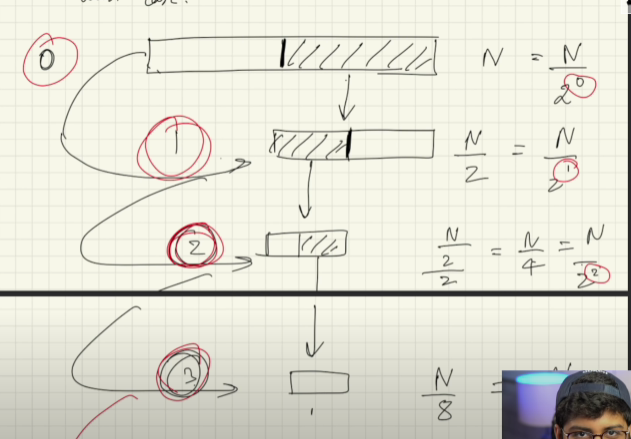
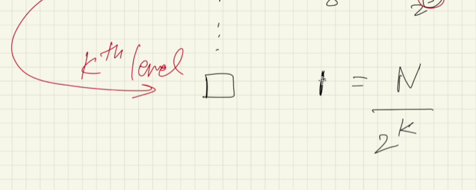
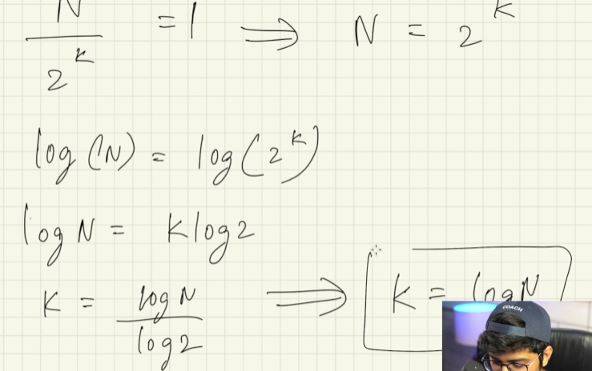
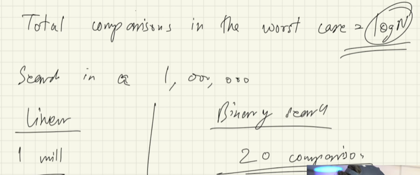
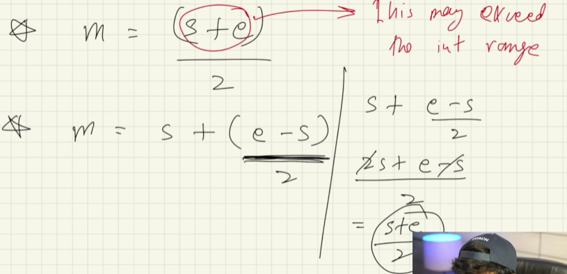

# Binary search :

**What is binary search?**

Binary search is a fast search algorithm with run-time complexity of O(log n). This search algorithm works on the principle of divide and conquer. For this algorithm to work properly, the data collection should be in the sorted form.


**How binary search works?**

For a binary search to work, it is mandatory for the target array to be sorted. The idea of binary search is to use the information that the array is sorted and reduce the time complexity to O(log n).

- It can be only applied to sorted arrays.
- It works by comparing the middle element of the array with the target value.
- If the target value matches the middle element, its position in the array is returned.
- If the target value is less than the middle element, the search continues in the lower half of the array.
- If the target value is greater than the middle element, the search continues in the upper half of the array.
- This process continues on the sub-array as well until the size of the subarray reduces to zero.
- If the search ends with the remaining sub-array being empty, the target is not in the array.
- The time complexity of the binary search algorithm is O(log n).

**How binary Search works**




**Why is binary search faster than linear search?**
-> If we have 1 million, with linear search we need to comapre 1 million times, but with binary search we need to compare 20 times only. 



**Pseudocode for binary search:**

```java
public class binarySearch {
    public static void main(String[] args) {
        
        int[] arr = {1, 2, 3, 4, 5, 6, 7, 8, 8, 9, 10};
        int target = 5;
        int result = binarySearchInArray(arr, target);    
        
        system.out.println(result);     // 4
        
        target = 12;
        result = binarySearchInArray(arr, target);
        system.out.println(result);     // -1
        
        target = 8;   //checking for duplicate elements
        result = binarySearchInArray(arr, target);
        system.out.println(result);     // 7  // it will return the first occurance of the element
        
    }
    
    static int binarySearchInArray(int[] arr, int target){
        int start = 0;
        int end = arr.length -1;
        
        while(start <= end){
            //find the middle element
            //int mid = (start + end) / 2; // this can cause overflow cause start + end can be greater than the int range
            int mid = start + (end - start) / 2;
            
            if(target < arr[mid]){           // if target is less than mid, then we need to search in the left side of the array
                end = mid -1;                  // chnaging the end to mid -1
            } else if (target > mid) {        // if target is greater than mid, then we need to search in the right side of the array
                start = mid + 1;               // changing the start to mid + 1
            }else { 
                return mid;                     // if target is equal to mid, then return mid
            }
            
            
        }
    }
}
```
**how to calculate mid without overflow?**



# What if we don't know the array is sorted or not?

If we don't know the array is sorted or not, then we use order-agnostic binary search. 


**Order-Agnostic Binary Search : **

- In normal binary search, we are given a sorted array and we have to find the position of a given target value.
- In order-agnostic binary search, we are not given the order of the array. We have to find the order of the array and then find out the position of the target value.
- The time complexity of order-agnostic binary search is O(log n).
- The idea is to find the order of the array and then apply binary search accordingly.
- To find the order of the array, we can compare the first and last elements of the array.
- If the first element is less than the last element, the array is sorted in ascending order.
- If the first element is greater than the last element, the array is sorted in descending order.
- Once we know the order of the array, we can apply binary search accordingly.
- If the array is sorted in ascending order, we can apply normal binary search.
- If the array is sorted in descending order, we can apply binary search with a few modifications.
- The time complexity of order-agnostic binary search is O(log n).
- The space complexity of order-agnostic binary search is O(1).

