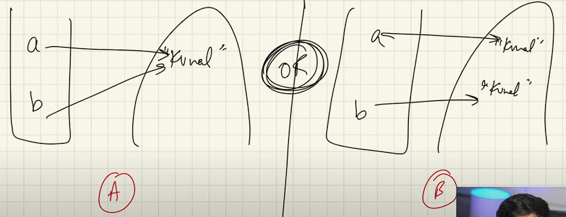
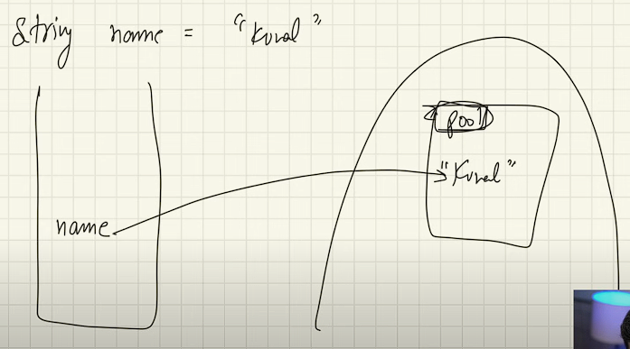
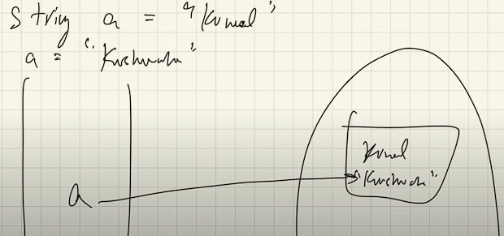
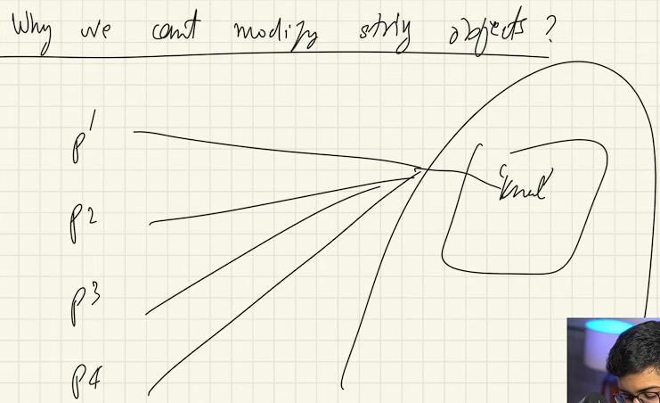
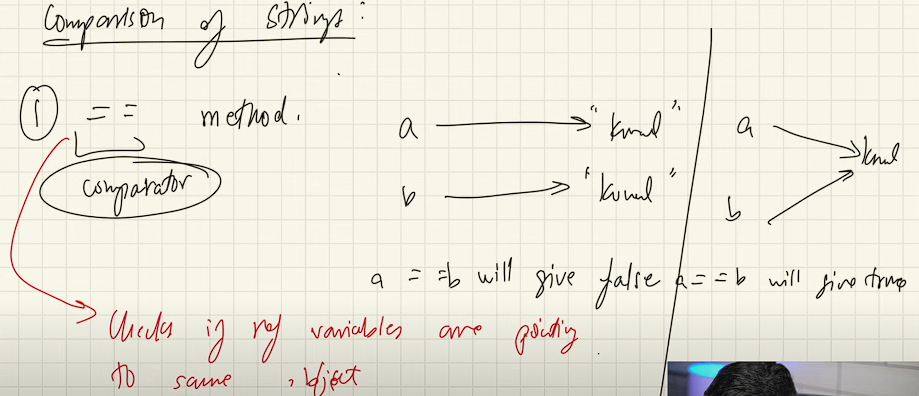
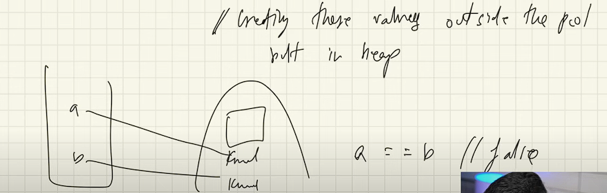

**Strings:** (Window + ctrl + click):-
 

`String name = "Ankit Maurya";`

String         --> Datatype  
name           --> reference Variable  
"Ankit MAurya" --> Object  

In JAVA, anything starts with Capital is Class.

------------------------------------------------------------------

`String a = "ankit";
String b = "ankit";`

Is they both pointing the same object in heap memory or different objects??

Ans:

Actually, it is stored in string pool. String Pool is a separate memory structure inside the Heap Memory. 

All the similar value of string can't be recreated in pool. Means no matter how many object created in Stack memory if the value will same then it will point the same object in heap memory.

It is similar like the Array object pointing same value in Heap memory. But there we can chanege the value from another reference variable, but here it can't change the value via another reference variable else it will corrupt the system. It default restricted in JAVA to prevent the security of a system. This behavior is called the Immutability.

 

Here we're not changing the object ankit we just reassigning the value "maurya" to a 

    String a ="ankit";
    System.out.println(a);

    a = "maurya";
    System.out.println(a);

now the value "ankit" will be goes to the garbage.

------------------------------------------------------------------

Why Immutability ?? 
Why can't we modify a string object?

  
 
Ans: Simply for security reasons. 

______________________________________________________________________

How do we got to know whether more reference variables pointing the same value??

Ans:
Method 1 : ( == )

It checks weather reference variable pointing to same value or not.
 

Q. What if we want it different value in heap memory despite having same value

        //How to create a different object of the same value

        String c = new String("Ankit");
        System.out.println( a == c);          //lets Compare c and a will return false

        String d = new String("Ankit");
        System.out.println( c == d);          //Or compare c and d will return false

 

Method 2 : ( equal() )

When you need to check the only value

    System.out.println(a.equals(b)); 
     String c = new String("Ankit");
    System.out.println( a == c);          //lets Compare c and a will return false

    String d = new String("Ankit");
        System.out.println( c == d);
