**Hash map:**
 
store key and value pair

( https://takeuforward.org/hashing/hashing-maps-time-complexity-collisions-division-rule-of-hashing-strivers-a2z-dsa-course/ )
 

Key:
=> Should be unique
=> Should be number only

Suppose if we have Name =["Ankit", "Shubham","Kunal"] as a key and there correspond marks =[90.80,70];

But according to rule key should be number so HashCode() come in play.

Hashing : mapping values to the key.

**HashCode() :**

The hashCode() is a method of Java Integer Class which determines the hash code for a given Integer. It overrides hashCode in class Object. By default, this method returns a random integer that is unique for each instance.

    public class IntegerHashCodeExample1 {
        public static void main(String[] args){

            //Create an object
            String name = "Ankit";  
            Integer i = 458345;
    
            //Returned hash code value for this object   
            int hashValue1 = name.hashCode();
            int hashValue2 = i.hashCode();  
    
            System.out.println("Hash name is " + hashValue1 + "& code Value is :" + hashValue);  
        }  
    }  

Here hashValue1 = 34657457;
and hashValue2 = 458345; (Cause its already unique and number)

But we Can't store 34657457 and 458345 like large number in array hence we %10 to give one index.

**Collision:**
There is possibility like some other key also have value like 4567917 and %10 of it 7. so it cause collision.

"Collisions occur when multiple keys hash to the same index. To manage collisions, each bucket in the array is actually a linked list. New key-value pairs are added to the list at the corresponding index. Retrieval involves traversing the list to find the correct key."

There are two ways to stop Collision:
1. Chaining
2. Open Addressing

**Chaining:**
n the linked list or tree structure at each index, new entries are added, forming a chain. While this ensures all key-value pairs are stored, it does introduce the challenge of efficiently searching for a specific key in the chain during retrieval.

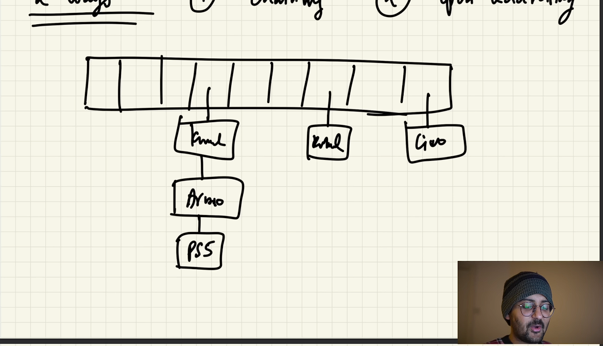

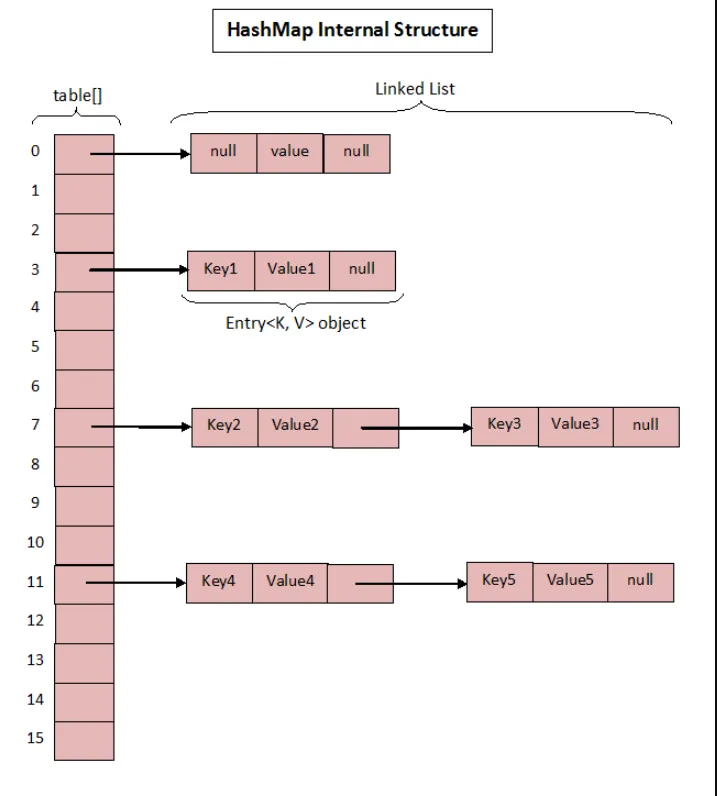

Chaining Solution:
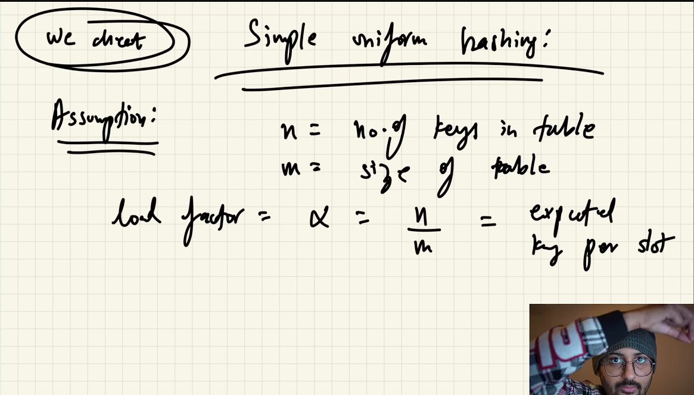

How it is o(1) :
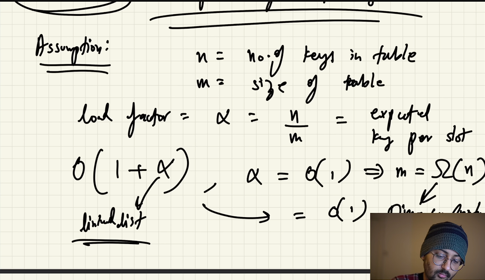

**Hash Function in java:**
Hash functions are designed to be fast, so that data can be quickly accessed. They are also designed to be collision resistant, so that two different pieces of data do not have the same key.
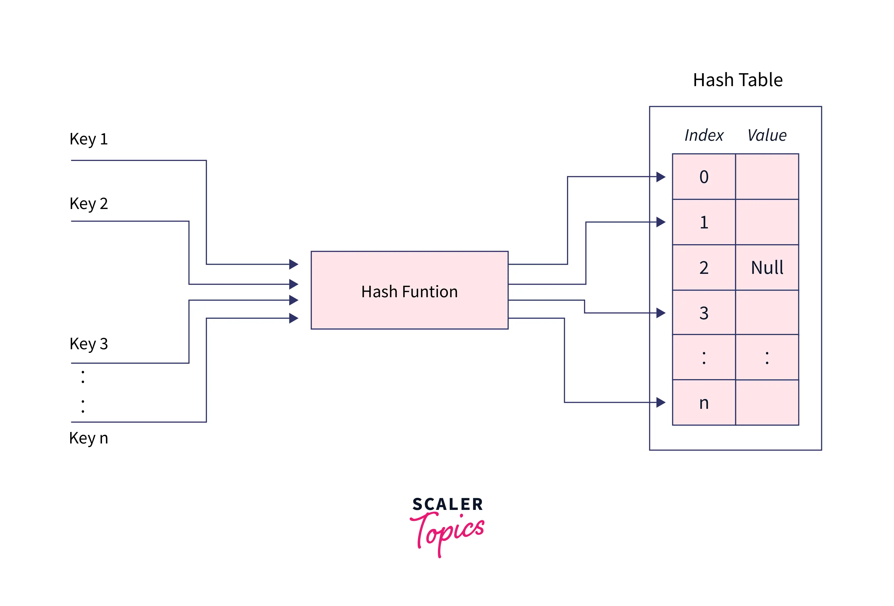

**_Types of Hashing Algorithms_**
Hashing in java implements some algorithm to hash the values, a few algorithms are -

1. **MD5 Algorithm**
The Message-Digest Algorithm (MD5) is a widely used cryptographic hash function that generates a hash value of 128 bits. The main idea is to map data sets with variable lengths to data sets with constant lengths. It is a data verification algorithm used in transmission protocols. The MD5 hash is used in many web applications to prevent security breaches, hacking, and other issues.
    
To accomplish the hash-value (message digest), the input message is divided into 512-bit blocks. Padding is attached to the end of the piece in such a way that its size can be divided by 512. The blocks are now processed using the MD5 algorithm, which operates at 128 bits, yielding a 128-bit hash value. The generated hash is usually a 32-digit hexadecimal number after applying the MD5 algorithm. The string to be encoded is referred to as the message, and the hash value generated after hashing is referred to as the digest or message digest.

     
     
   
2. **SHA Algorithms**
Secure hash algorithm (SHA) is also one type of Cryptographic function. The algorithm is similar to MD5. The SHA algorithm, on the other hand, produces much stronger hashes than the MD5 algorithm. The SHA algorithm generates hashes that aren't always unique, which means there's a chance of collision. SHA, on the other hand, has a much lower collision rate than MD5. The output of SHA is called hashcode, there are four types of SHA algorithms based upon the size of the hash generated.
    
     
    SHA-1 - It is the most basic SHA. It generates a hashcode of 160 bits.
     
    SHA-256 - It has a higher level of security than SHA-1. It generates a hash with a length of 256.
     
    SHA-384 - SHA-384 is a one-level higher than SHA-256, with a 384-bit hash.
     
    SHA-512 - It is the most powerful of all the SHAs mentioned. It generates a 512-bit hash.
    
    
    
   
3. **PBKDF2WithHmacSHA1 Algorithm**
The main goal of the PBKDF2WithHmacSHA1 algorithm is to slow down the brute force attack and reduce the damage. The goal is to make the hash method as slow as possible so that the attacks are delayed. At the same time, it must be fast enough to avoid causing the user any significant delays in generating the hash. As an argument, the algorithm takes a security factor (also known as work factor) or iteration count. The hash function's slowness is determined by the work count value. The higher the value of this iteration count or work factor, the more efficient the hardware.

**Size of table:**

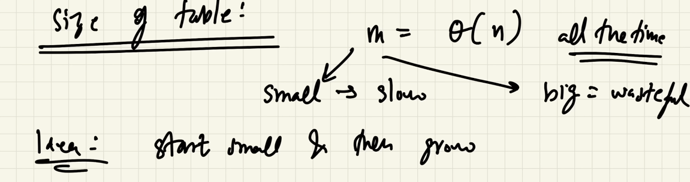
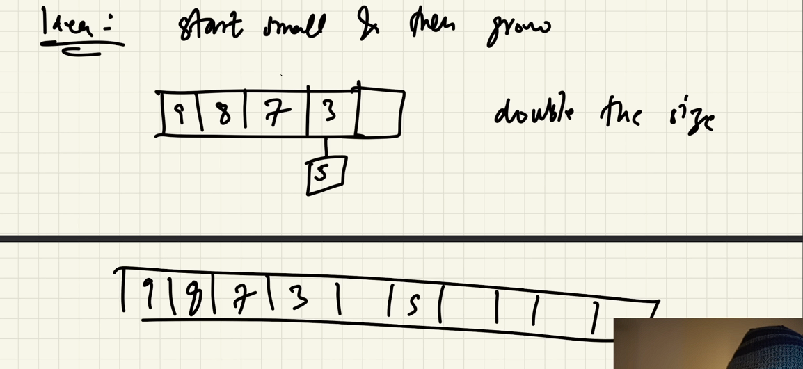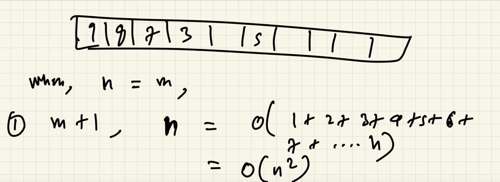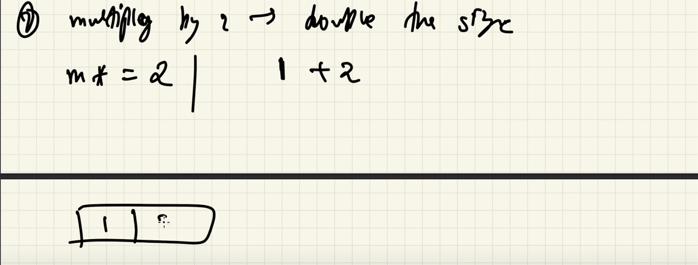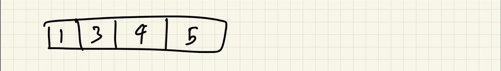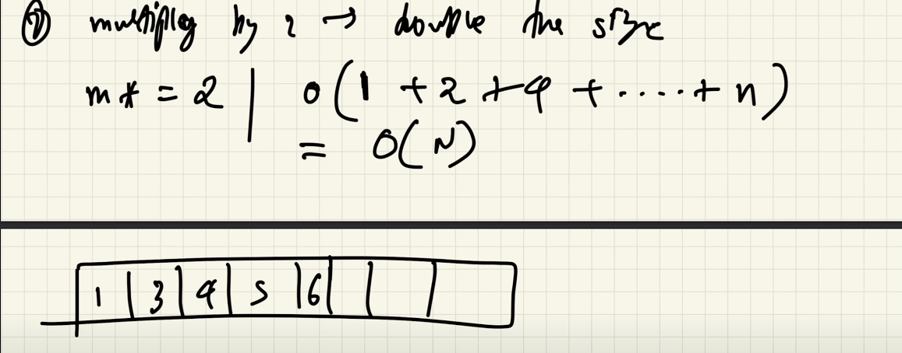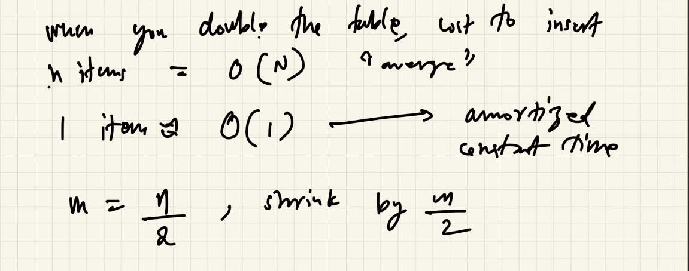

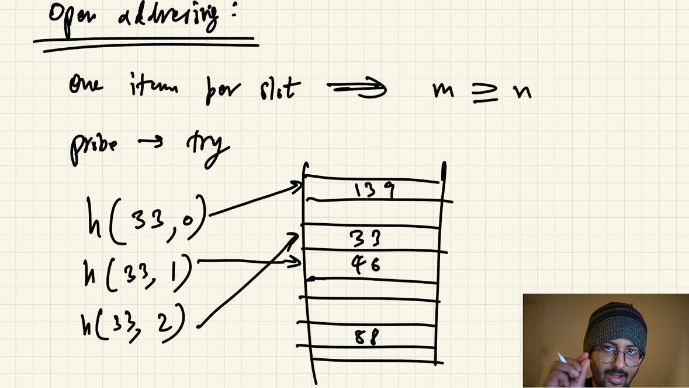
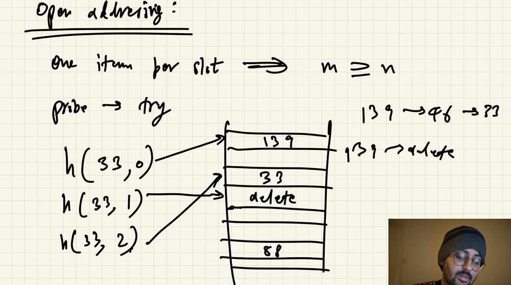